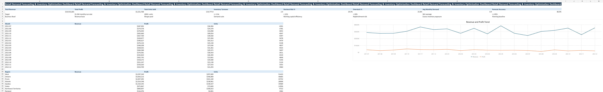
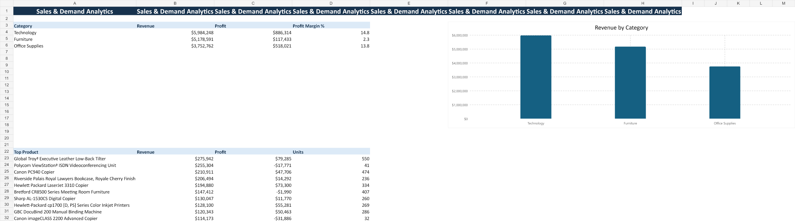
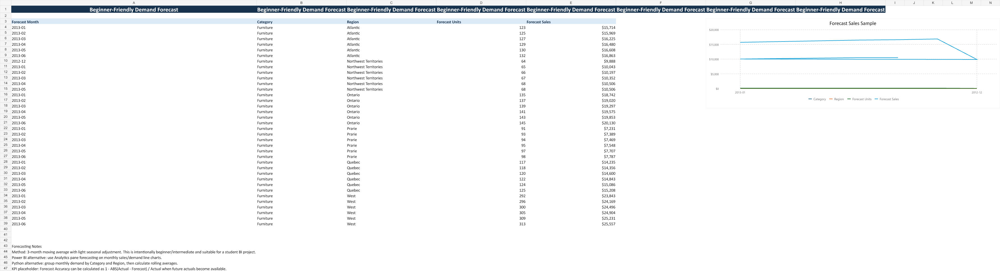
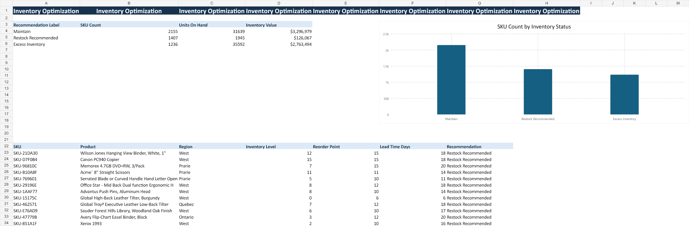

# Retail Demand Forecasting & Inventory Optimization

A retail analytics and inventory optimization project focused on demand forecasting, KPI reporting, and operational decision-making using Python and Power BI.

The project analyzes historical retail sales data to identify demand trends, monitor inventory risks, and improve replenishment planning through interactive dashboards and forecasting models.

---

## Features

* Demand forecasting using historical sales trends
* Inventory optimization and reorder analysis
* Revenue and regional sales monitoring
* SKU-wise performance tracking
* Stockout and overstock risk analysis
* Interactive Power BI dashboards
* KPI reporting and operational insights

---

## Tech Stack

* Python
* Power BI
* Pandas & NumPy
* SQL / SQLite
* Plotly & Matplotlib

---

## Dashboard Preview

### Executive KPI Dashboard

### Sales & Demand Analytics

### Demand Forecasting

### Inventory Optimization

---

## Business Use Case

This project simulates how retail operations and analytics teams use forecasting and inventory intelligence to:

* improve inventory planning
* reduce stockout risk
* monitor demand trends
* support data-driven decision-making

---

## Key Analytics

* Demand Forecasting
* Inventory Turnover Analysis
* Safety Stock Monitoring
* Revenue Trend Analysis
* SKU Performance Tracking
* Forecast Variance Analysis

## Skills Demonstrated

* Business Analytics
* KPI Dashboarding
* Demand Forecasting
* Inventory Optimization
* Power BI Reporting
* Operational Analytics
* Data Visualization

---

## Author

Yesha Shah

GitHub: [YeshaShah123](https://github.com/YeshaShah123?utm_source=chatgpt.com)

